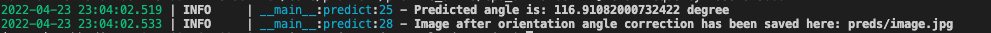
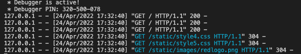
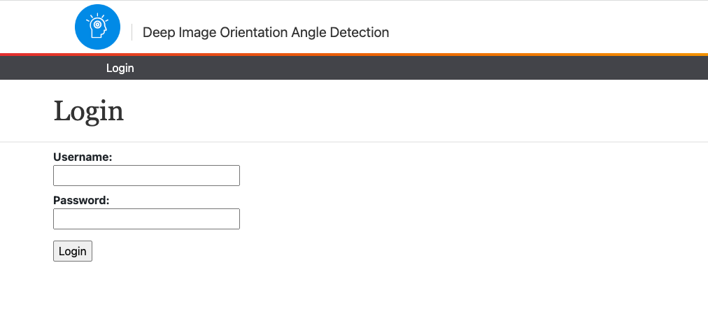
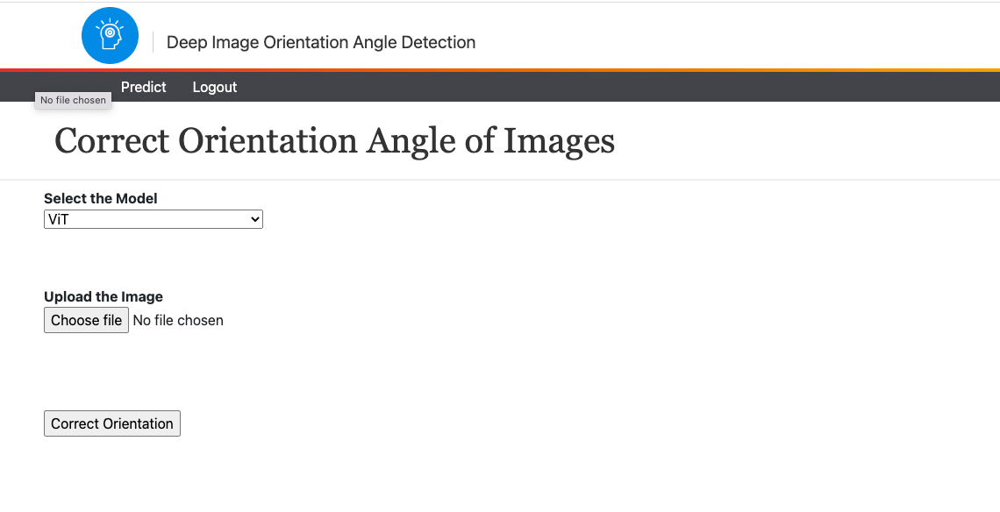
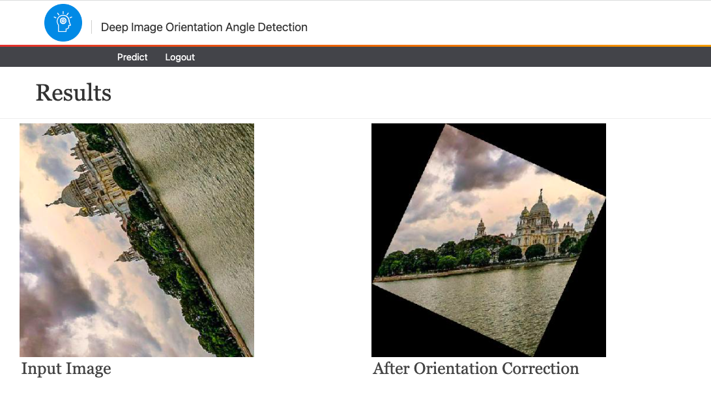

# Deep Image Orientation Angle Detection

*Annoucement: Version 2 of Deep Image Orientation Angle Detection is out with the following features:*

- *VIT Implementation*
- *Seamless training and inference from terminal*
- *Web application*
- *Dynamic data preparation*

## Introduction
Image Orientation Angle Detection Model (Deep-OAD) is a deep learning model to predict the orientation angle of the natural images. This repository allows to train, finetune and predict with a Deep-OAD model. The academic paper is available here:  https://arxiv.org/abs/2007.06709

## Data Preparation
Data preparation in this verison is flawless. We have a training generator that dynamically rotates the images to random angles and trains model. For that, the experimenter needs to put the training images under the [training data](./data/train/) directory. For validation and test, there is a separate [validation and test](./data/validation-test/) directory. As we want to validate or test against same set of rotates images, there is an additional file [validation-test.csv](./data/validation-test.csv) that contains whether an image is under validation or test set and it's label. **Please make sure all the images under [training data](./data/train/) and [validation and test](./data/validation-test/) directory are correctly oriented. Our generator will take care of the rotation and produce training, validation and test losses and metrics accordingly.**

## Model Training
To train a model first install the required packages from the terminal,

```
$ pip install -r requirements.txt
```

Then run the following command in the terminal,

```
$ python train.py --gpu=<gpu_index_number_for_training> --model-name=<model_name> --train-dir=<path_to_the_train_directory> --validation-dir=<path_to_the_train_directory> --validation-label-path=<path_to_label_csv_path_of_validation_data> --batch_size=<batch_size_for_training> --weights-save-path=<model_weights_save_path> --load-pretrained-weights=<whether_to_load_pretrained_weights>
```

The arguments are described below,

- `--gpu`: GPU index number to use for training. Default value is `-1`, that means by default the model will be trained in CPU. Currently it supports single GPU training.
- `--model-name`: Name of the model to be used for training. Default value is `vit`. Currently VIT is the only model. We are working to bring more models under the umbrella.
- `--train-dir`: Path to the training image directory. Default value is `data/train/`
- `--validation-dir`: Path to the validation image directory. Default value is `data/validation-test/`
- `--validation-label-path`: Path to CSV path where orientation angle of the validation and test images are stored. Default value is `data/validation-test.csv`
- `--batch_size`: Batch size for model training. Default value is 16.
- `--weights-save-path`: Model save weights path. 
- `--load-pretrained-weights`: If `True` the training will start from the best pre-trained weights on COCO for the orientation angle detection task. If `False` the training will start from the `imagenet` weights pre-trained on classification task. Default value is `True`.

one example coommand for training using the default parameters would be,

```
$ python train.py  --weights-save-path=weights/test_weight.h5
```

## Saved Model
You can download a trained Keras model [here](https://drive.google.com/file/d/1gI20xkDOz37mz1PuXZCdcVI2x79rAFRd/view?usp=sharing). This model is trained on artifically created dataset using almost all of the images of Microsoft COCO. This model is capable to predict orientation of images between 0° to 359° with test MAE of 6.5°. You can use this model for finetuning or model predictions. Please make sure the model file is put under [weights](./weights/) directory during finetuning or inference.

## Model Inference
To predict orientation angle of an image from terminal run the following command,
```
$ python infer.py --model-name=<model_name> --image-path=<path_to_the_image_file> 
```

The arguments are described below,

- `--model-name`: Name of the model to be used for training. Default value is `vit`. Currently VIT is the only model. We are working to bring more models under the umbrella.
- `--image-path`: Path to the image file whose orientation angle to be predicted.

one example command for inference using the default parameters would be,

```
$ python infer.py --image-path=./inputs/image.jpg
```

Upon running the command the predicted orientation angle will be printed in the terminal as shown below. The image file after orientation angle correction would be saved in [preds](./preds/) directory. 



*Note: This inference method is not optimal as everytime during the inference the model file has to be loaded which takes signficant amount of time.*

## Results
This method used the combination of CNN and a custom angluar loss function specially designed for angles that lead to a very promising result with respect to the recent works in this domain. Below is the result table picked from the above-mentioned academic [paper](https://arxiv.org/abs/2007.06709). It shows comparison between our OAD model and other image orientation angle estimation techniques. It is clearly seen that our OAD model outperforms other baseline methods and achieve very good results in terms of test mean absolute error (MAE).


| Task                                  | OAD-30 | Net-30 | OAD-45 | Net-45 | OAD-360 | Net-360 | Hough-var | Hough-pow | Fourier   |      
| ------------------------------------- |:------:|:------:|:------:|:------:|:-------:|:-------:|:---------:|:---------:|:---------:|
| Test images with ±30 degree rotation  |**1.52**|   3    |   -    |   -    |    -    |    -    |  11.41    |  10.62    |   10.66   |
| Test images with ±45 degree rotation  |   -    |   -    |**1.95**|  4.63  |    -    |    -    |  16.92    |  13.06    |   16.51   |
| Test images with ±180 degree rotation |   -    |   _    |   -    |   -    |**6.50** |  20.97  |     -     |     -     |     -     |

## Set up Web Application
We have created a web application using Flask and HTML through which experimenters can upload any image and correct the orientation using our pre-trained model. To use this application first make sure that the model is under [weights](./weights/) directory and run the following command from the terminal to install the required libraries.

```
$ pip install -r requirements.txt
```

Then from the terminal run,
```
$ python run.py
```

It will take sometime to serve as in the backend the pre-trained model will be loaded. Once the web application starts serving, the below messages will appear in the terminal.



The web app will be served in `5050` port in the local server. If that port is busy change the port number to any other allowable number from [run.py](./run.py). Once done, open [localhost:5050](http://localhost:5050) from any browser (preferably Chrome). This will land you up in the UI shown below.



Click on [login](http://localhost:5050/login) to login. 

- Usernam: admin
- Password: 1234

Once you login successfully click on [predict](http://localhost:5050/predict) to predict and correct the orientation of images. This will land you up to the following UI. 



Now do the following.
- Click `command + shift + R` (for MAC users) and `ctrl + shift + R` (for Windows users) to clear cache and reload the page. For some browser the prediction is stuck due to browser cache issue. You have to do this before every prediction. 
- Select the Model from the dropdown to correct the orientation of the image.
- Click on `Choose file` to upload the image. The image must be in either `.jpg` or `.jpeg` format.
- Click on the `Correct Orientation` button to correct the orientation of the image. This will land you up to the results page. One example of results page is shown below. 



## Citation
This paper is submitted for journal publication. If you are using this model then please use the below BibTeX to cite for now.

```
@ARTICLE{2020arXiv200706709M,
       author = {{Maji}, Subhadip and {Bose}, Smarajit},
        title = "{Deep Image Orientation Angle Detection}",
      journal = {arXiv e-prints},
     keywords = {Computer Science - Computer Vision and Pattern Recognition, Computer Science - Machine Learning, Electrical Engineering and Systems Science - Image and Video Processing},
         year = 2020,
        month = jun,
          eid = {arXiv:2007.06709},
        pages = {arXiv:2007.06709},
archivePrefix = {arXiv},
       eprint = {2007.06709},
 primaryClass = {cs.CV},
       adsurl = {https://ui.adsabs.harvard.edu/abs/2020arXiv200706709M},
      adsnote = {Provided by the SAO/NASA Astrophysics Data System}
}
```

## More Information
For any clarification feel free to raise an issue. Additionally you can reach us at subhadipmaji.jumech@gmail.com